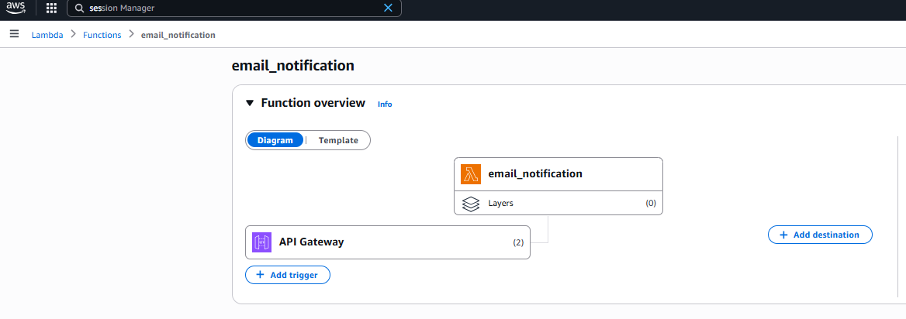
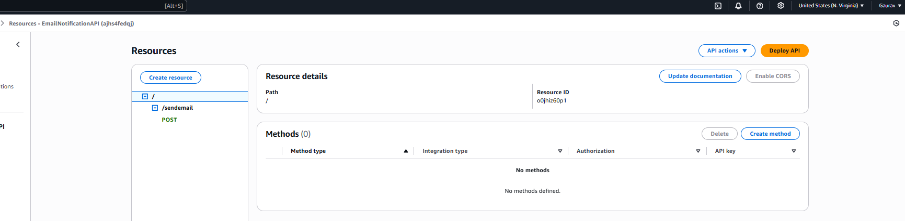
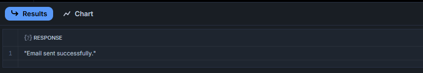
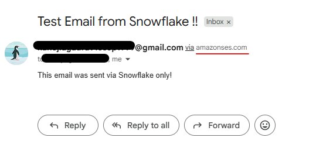

# 📧 Send Emails from Snowflake Using AWS SES + Lambda + API Gateway

This project demonstrates how to **send emails directly from Snowflake** using:

✅ **Snowflake External Functions**  
✅ **AWS Lambda** to trigger an email via **SES (Simple Email Service)**  
✅ **API Gateway** to expose a secure endpoint callable from Snowflake

---

## 🧱 Architecture Overview
Snowflake SQL ➜ External Function ➜ API Gateway ➜ Lambda ➜ AWS SES ➜ Email Sent


---

## 🔧 Prerequisites

- AWS account
- SES setup in the same region as your Lambda function (email sending sandbox or production)
- Email addresses verified in SES
- Snowflake account (Enterprise or higher) with external network access enabled
- IAM Role in AWS to let Snowflake invoke API Gateway

---

## ✅ 1. Verify Email Addresses in AWS SES

1. Go to the [SES Console](https://console.aws.amazon.com/ses/)
2. Choose **Verified Identities**
3. Click **Create Identity**
4. Add:
   - Your `from_email` address (sender)
   - Your recipient emails (if still in SES Sandbox)
5. Confirm the verification via email

---

## 🔁 2. Create Lambda Function for Sending Email

```
import json
import boto3

# Initialize SES client
ses = boto3.client('ses')

def lambda_handler(event, context):
    try:
        print("📥 EVENT RECEIVED:", json.dumps(event))

        # Parse input from API Gateway + Snowflake or Postman
        from_email = to_emails = subject = message = None

        if "body" in event and isinstance(event["body"], str):
            payload = json.loads(event["body"])

            # Snowflake input: check for "data" key
            if "data" in payload and isinstance(payload["data"], list):
                row = payload["data"][0]
                _, from_email, to_emails, subject, message = row
            else:
                # If sent from Postman/API Gateway (direct input)
                from_email = payload.get("from_email") or payload.get("from")
                to_emails = payload.get("to_emails") or payload.get("to")
                subject = payload.get("subject")
                message = payload.get("message")

        else:
            # Fallback (Lambda console test event)
            from_email = event.get("from_email")
            to_emails = event.get("to_emails")
            subject = event.get("subject")
            message = event.get("message")

        print(f"📧 FROM: {from_email}")
        print(f"📬 TO: {to_emails}")
        print(f"✉️ SUBJECT: {subject}")
        print(f"📝 MESSAGE: {message}")

        # ✅ Input validation
        if not from_email or not to_emails or not subject or not message:
            return {
                "statusCode": 400,
                "body": json.dumps({
                    "data": [[0, "Missing required fields (from_email, to_emails, subject, message)"]]
                })
            }

        # ✅ Send the email
        response = ses.send_email(
            Source=from_email,
            Destination={'ToAddresses': to_emails},
            Message={
                'Subject': {'Data': subject},
                'Body': {'Text': {'Data': message}}
            }
        )

        message_id = response["MessageId"]
        print("✅ SES Response:", json.dumps(response))


        # ✅ Return JSON array of arrays (REQUIRED by Snowflake)
        return {
            "statusCode": 200,
            "body": json.dumps({
                "data": [[0, "Email sent successfully."]]
            })
        }

    except Exception as e:
        print("❌ ERROR:", str(e))
        return {
            "statusCode": 500,
            "body": json.dumps({
                "data": [[0, f"Internal error: {str(e)}"]]
            })
        }

```


---

## 🌐 3. Create API Gateway for Lambda

1. Open **API Gateway** in AWS Console
2. Create a new **HTTP API**
3. Add a route, e.g., `/sendemail`
4. Integrate it with the Lambda function you created
5. Deploy and get the **Invoke URL**, such as:

https://<your-code-values>.execute-api.us-east-1.amazonaws.com/DEV/sendemail

---


---
## 🔐 4. Create IAM Role for Snowflake

Create an IAM role Snowflake can assume:

```
{
"Version": "2012-10-17",
"Statement": [
{
"Effect": "Allow",
"Principal": {
"AWS": "arn:aws:iam::<SNOWFLAKE_AWS_ACCOUNT_ID>:root"
},
"Action": "sts:AssumeRole"
}
]
}
```


Attach policies that allow invoking your API Gateway.

---

## ❄️ 5. Configure Snowflake API Integration

### Step 1 – Create API Integration

```
CREATE OR REPLACE API INTEGRATION my_email_api_integration
    API_PROVIDER = AWS_API_GATEWAY
    API_AWS_ROLE_ARN = 'arn:aws:iam::<your-iam-value>:role/snowflake-connector'
    ENABLED = TRUE
    API_ALLOWED_PREFIXES = ('https://<your-code-value>.execute-api.us-east-1.amazonaws.com/DEV/sendemail');

```
### Step 2 – Describe Integration (verify setup)


## 📮 6. Create External Function in Snowflake

```
create or replace external function send_email_external(
    from_email varchar,
    to_email array,
    subject varchar,
    message varchar
)
returns variant
api_integration = your_api_integration
as 'https://<your-code-value>.execute-api.us-east-1.amazonaws.com/DEV/sendemail';
```

## 📮 7. Grant Necessary IAM Roles

Snowflake’s role (configured for the API integration) must be able to sign requests to API Gateway.

Lambda's IAM role must allow ses:SendEmail.

## ❄️ 8. Trigger from Snowflake

```
  SELECT send_email_to_distlist(
    'sender-email', 
    ARRAY_CONSTRUCT('email1@gmail.com', 'email2@gmail.com'), 
    'Test Email from Snowflake', 
    'This email was sent via Snowflake only!'
  ) AS response;

```


---
